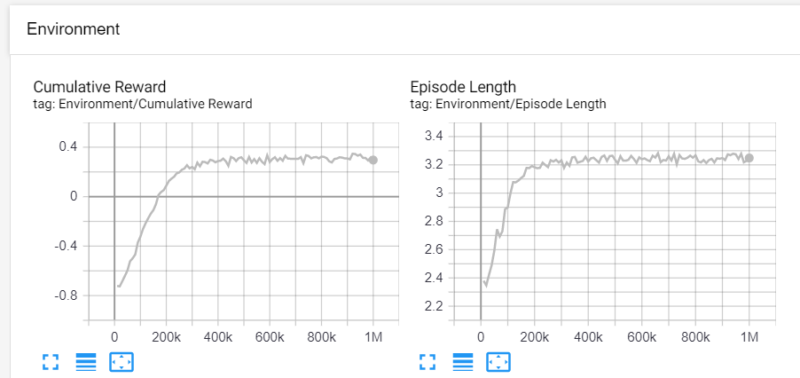
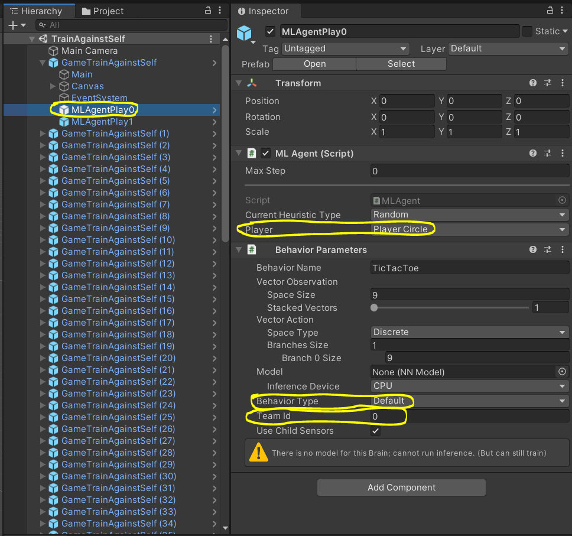
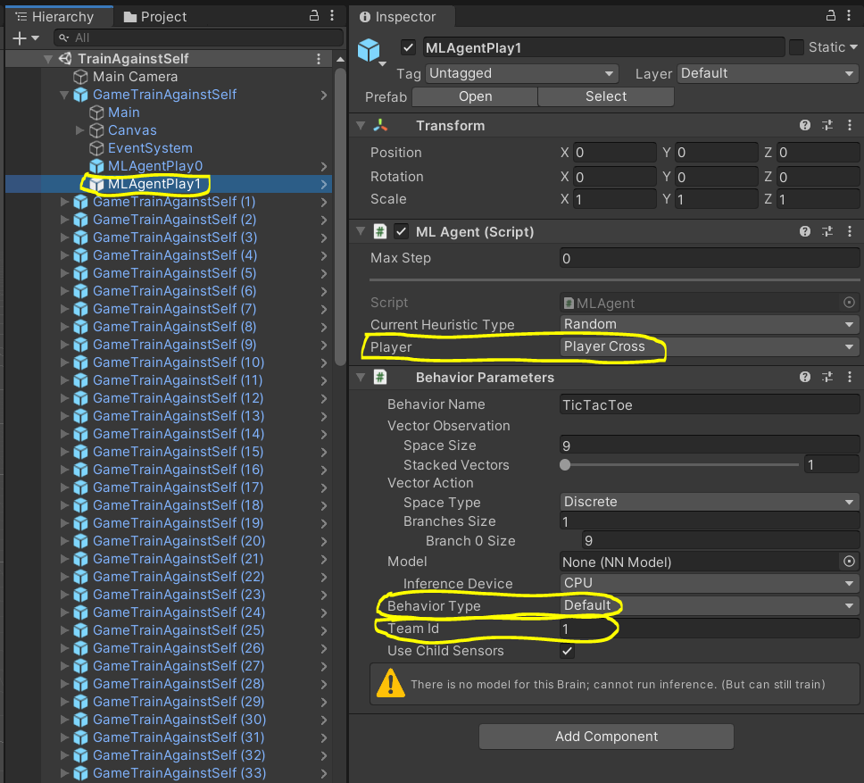
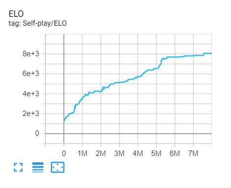

# TicTacToeML with Unity ml-agents
If you are here, the chances are you are still learning machine learning stuff just like myself. I highly encourage you to build this project by yourself before take a look at my code and settings. You will learn a lot of things and find questions that you didn't even think about before building it by yourself. Those questions will greatly improve your skills and knowledge about ML. :)

# Settings
Alright first thing is first. Please follow Getting Started page in Unity and make it sure you can play and train the example project.

https://github.com/Unity-Technologies/ml-agents/blob/master/docs/Getting-Started.md

Once you are done with the tutorial, you should be able open this project with no issue.

# Projects
There are three Visual Studio 2019 projects here.

1. TicTacToeLib - This is a pure game logic library project.
2. TicTacToeCmd - This is a command line window tic-tac-toe client.
3. TicTacToeUnity - This is a Unity client.

I like to have a separate game logic project from Unity because it allows me to test things out quickly without launching Unity. This approach is also very useful if you want to run your game with different GUIs (Command Line vs. Unity) or even no GUI for server.  

[TicTacToe.sln](./TicTacToe.sln) contains TicTacToeLib and TicTacToeCmd projects. [TicTacToeUnity.sln](./TicTacToeUnity/TicTacToeUnity.sln) contains TicTacToeUnity project. If you are only interested in the machine learning part, you can ignore TicTacToeLib and TicTacToeCmd projects.

# Unity
TicTacToeUnity is using Unity 2019.4.4f1. You should be able to open it by choosing [TicTacToeUnity](./TicTacToeUnity) directory through Unity Hub.

# Play against the trained model
If you want to play against the neural network model I trained, please open [PlayAgainstML](./TicTacToeUnity/Assets/Scenes/PlayAgainstML.unity) scene. You will play as X and NN will take O. If you want to use a different model, you can just drag and drop to Model field of MLAgentPlay.

> :warning: [The model I trained](./TicTacToeUnity/Assets/NNModels/TicTacToeSelfPlay.nn) is very strong. In fact, I'm not able to win. 😬

# Train against the random AI
If you want to train the model with the random AI, please open [TrainAgainstRandom](./TicTacToeUnity/Assets/Scenes/TrainAgainstRandom.unity) scene. You will notice that there are two MLAgentPlay. The first one is for training. The second one is the random AI implemented through `void Heuristic(float[] actionsOut)`. 

 

Now you can run the below command and start play in Unity for training.
> mlagents-learn .\TicTacToeUnity\Assets\Configs\ml_single_config.yaml --run-id=Random

You can also watch the progress through [Tensorboard](https://github.com/Unity-Technologies/ml-agents/blob/master/docs/Using-Tensorboard.md).

My reward system is very simple. Win(1), Tie(0) and Lose(-1). As you can see, it quickly reached to near 1. But do not expect this model will play well. Even though it learns pretty well to beat the random AI, it is really bad at playing against human. This was my first approach.

# Train against the basic AI
If you want to train the model with the basic AI, please open [TrainAgainstBasic](./TicTacToeUnity/Assets/Scenes/TrainAgainstBasic.unity) scene. You will notice that there are two MLAgentPlay. The first one is for training. The second one is the basic AI implemented through `void Heuristic(float[] actionsOut)`. 

Now you can run the below command and start play in Unity for training.
> mlagents-learn .\TicTacToeUnity\Assets\Configs\ml_single_config.yaml --run-id=Basic

Here is the graph I got.

This one stops growing at near 0.4 reward. Even though the average reward is much lower than the previous training against the random AI, it actually plays much better. Obviously it is because the model was trained against a better player. However, it is still not good enough when playing against human.

# Train against self.
The whole purpose of this project is developing AI without manual AI coding. If I have to write code for making a strong AI first (like the basic AI I wrote), there is no point of doing this. So we either need tons of data from strong human players or somehow find a way of teaching machine without our manual input. It turns out smart people already figured it out. Here comes Self-play!

[Training intelligent adversaries using self-play with ML-Agents](https://blogs.unity3d.com/2020/02/28/training-intelligent-adversaries-using-self-play-with-ml-agents/)

You can find the details through the above blog post. The gist is that you just let AI play against itself and it will figure out best way to win. You don't even need to write a random AI code. [TrainAgainstSelf](./TicTacToeUnity/Assets/Scenes/TrainAgainstSelf.unity) scene is for self-play training. You will notice that there are two MLAgentPlay for each game. The first one is for training. The second one is also for training! Notice that they are using a different Team Id.

 

> mlagents-learn .\TicTacToeUnity\Assets\Configs\ml_multi_config.yaml --run-id=Self

When you train the model with self-play, the average reward is not meaningful metric but Elo is. [Elo](https://en.wikipedia.org/wiki/Elo_rating_system) is a number for representing player's skill level. If you ever made match-making system, you should know about it already. Basically, as long as Elo is growing, there is a room for the model to improve. Here is the graph I got.

It stop growing after 6 million games. This trained model never lose!:triumph: (against me and my wife at least.:cry:)

# Mistakes
Obviously, I did not make all of this without any mistakes. Here they are.

1. For self-play training, I added one more feature that shows whether it is playing circle or cross. This was a huge mistake because this one feature makes a HUGE difference what it should do with the same board state. This is why my first couple of attempts with self-play was horribly failed. After removing this feature and invert the board state for cross player so that both of them are playing as circle player, it started learning really well.

2. Some of my hyperparameter settings (like batch_size and hidden_units) were just wrong for training discrete actions like tic-tac-toe. It was my bad that not carefully reading [the config doc](https://github.com/Unity-Technologies/ml-agents/blob/release_5_docs/docs/Training-Configuration-File.md). 

3. Missed normalizing features. (I'm not talking about normalizing weights in NN) I was initially using (0:Blank, 1:Circle, 2:Cross) but later change them to (-1:Cross, 0:Blank, 1:Circle). I knew I had to do this from my study but totally forgot. 

That's it. I've got a big help from [the forum](https://forum.unity.com/threads/tictactoe-with-self-play.945560/). I hope this helps someone who is trying to build a similar project.
