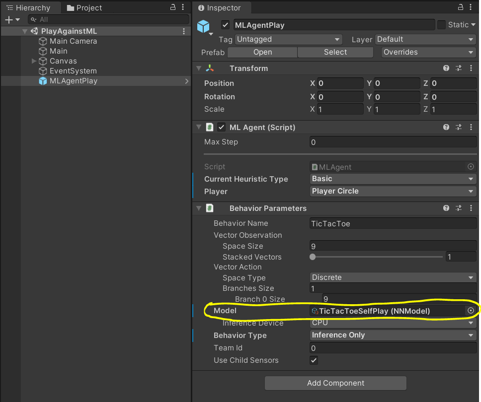
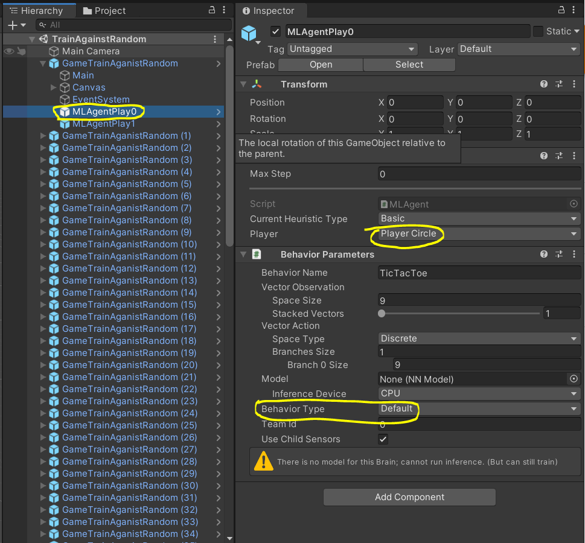
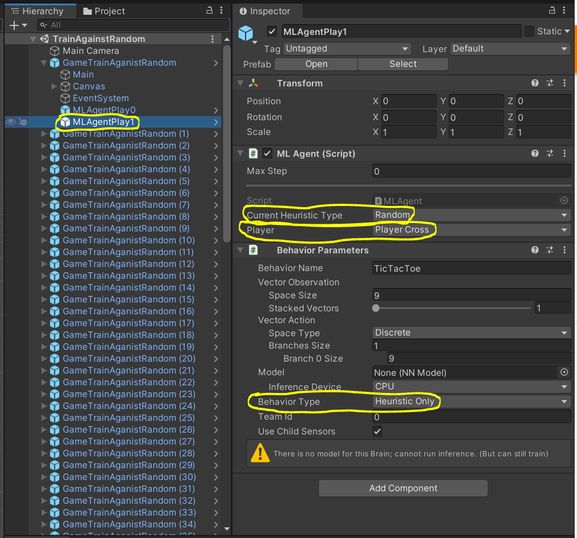
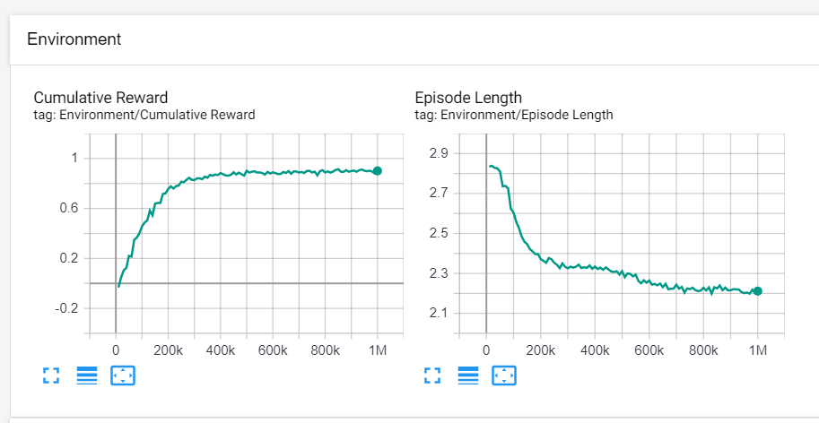

# TicTacToeML with Unity ml-agnets
If you are here, the chances are you are still learning machine learning stuff just like myself. I highly encourge you to build this project by yourself before take a look at my code and settings. You will learn a lot of things and find questions that you didn't even think about before building it by youself. Those questions will greatly improve your skills and knowledge about ML. :)

# Settings
Alright first thing is first. Please follow Getting Started page in Unity and make it sure you can play and train the example project.

https://github.com/Unity-Technologies/ml-agents/blob/master/docs/Getting-Started.md

Once you are done with the tutorial, you should be able open this project with no issue.

# Projects
There are three Visual Studio 2019 projects here.

1. TicTacToeLib - This is a pure game logic library project.
2. TicTacToeCmd - This is a command line window tic-tac-toe client.
3. TicTacToeUnity - This is a Unity client.

I like to have a seperate game logic project from Unity because it allows me to test things out qucikly without launching Unity. This approach is also very useful if you want to run your game with different GUIs (Command Line vs. Unity) or even no GUI for server.  

[TicTacToe.sln](./TicTacToe.sln) contains TicTacToeLib and TicTacToeCmd projects. [TicTacToeUnity.sln](./TicTacToeUnity/TicTacToeUnity.sln) cotains TicTacToeUnity project. If you are only interested in the machine learning part, you can ignore TicTacToeLib and TicTacToeCmd projects.

# Unity
TicTacToeUnity is using Unity 2019.4.4f1. You should be able to open it by choosing [TicTacToeUnity](./TicTacToeUnity) directory through Unity Hub.

# Play against the trained NN
If you want to play against the neural network model I trained, please open [PlayAgainstML](./TicTacToeUnity/Assets/Scenes/PlayAgainstML.unity) scene. You will play as X and NN will take O. If you want to use a differnt model, you can just drag and drop to Model field of MLAgentPlay.

> :warning: [The model I tranined](./TicTacToeUnity/Assets/NNModels/TicTacToeSelfPlay.nn) is very strong. In fact, I'm not able to win. 😬

# Train against the radom AI
If you want to train the model with the random AI, please open [TrainAgainstRandom](./TicTacToeUnity/Assets/Scenes/TrainAgainstRandom.unity) scene. You will notice that there are two MLAgentPlay. The first one is the one for training. The second one is the random AI implemented through `void Heuristic(float[] actionsOut)`. 

 

Now you can run the below command and start play in Unity for traning.
> mlagents-learn .\TicTacToeUnity\Assets\Configs\ml_single_config.yaml --run-id=Random

You can also watch the progress through [Tensorboard](https://github.com/Unity-Technologies/ml-agents/blob/master/docs/Using-Tensorboard.md).

My reward system is very simple. Win(1), Tie(0) and Lose(-1). As you can see, it quickly reached ver clost to 1. But do not expect this model will play well. Even though it learns pretty well to beat the random AI, it is really bad at playing against human. This was my first approach.

# Train against the basic AI
After I realized that I need a st

